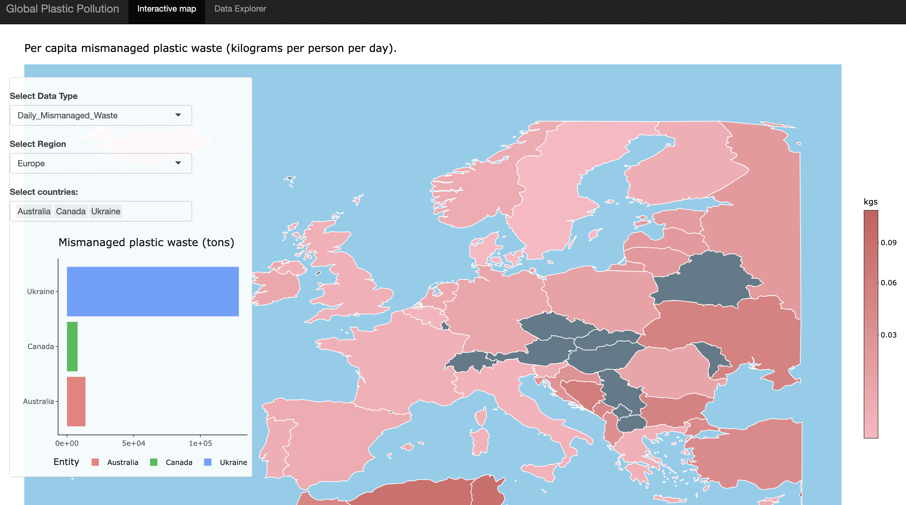

```{r, include = FALSE}
knitr::opts_chunk$set(
  collapse = TRUE,
  comment = "#>"
)
```

```{r setup, echo = FALSE}
library(dvwaste)
```

## About The App

The "Global Plastic Pollution" R Shiny app is created with the goal of increasing awareness about the issue of plastic pollution on a global scale. This interactive app allows users to explore data related to plastic waste generation and mismanagement in an informative way.

To begin, the app loads data from the `dvwaste` package, containing information about plastic waste, mismanaged plastic waste, and GDP per capita for different countries.

The app features an interactive heatmap function that allows users to visualize different aspects of plastic waste data. Users can choose from three data types, which include per capita plastic waste, per capita mismanaged plastic waste, and mismanaged waste in ton by country. They can also select a specific region or view global data.

Additionally, the app provides a bar chart function that allows users to select specific countries and see their contributions to mismanaged plastic waste in tons. They can select one or more countries to visualize their data. Users can also explore a top 5 bar chart function displaying the top 5 contributors to mismanaged plastic waste in tons, based on their selection of data type and region.

The app's user interface includes navigation tabs for different sections, interactive controls to select data type, region, and countries, and a visually appealing display of heatmaps and charts. The "Data Explorer" page provides information about the app's purpose, a description of the data sources used, and a link to a blog post for further reading on plastic pollution.

Overall, the app is designed to raise awareness about the global plastic pollution problem, encourage discussions about this issue, and provide insights into which countries contribute the most to this environmental challenge. By interacting with the app, users can gain a better understanding of the magnitude of plastic waste generation and mismanagement worldwide.

## Usage

To launch the Shiny App, user can...

```{r, eval=FALSE}
# Command to launch the R-Shiny app
library(dvwaste)
dvwaste::run_app()
```

## Shiny App: User Manual

### Interactive Map

In the app's Interactive Map section, you can see plastic waste data in an interactive map format. Here's how to use it:

-   Map Display: The map is at the center of the screen. You can interact with it to explore data. Data Type Selection: Use the `Select Data Type` dropdown to pick the data type you want to see. You can choose from **Per capita plastic waste**, **Per capita mismanaged plastic waste**, or **Mismanaged waste in tons by country**.

-   Region Selection: Choose a region from the `Select Region` dropdown menu to focus on specific geographic areas. Options include **World**, **North America**, **Europe**, **Oceania**, **Asia**, **South America**, and **Africa**.

-   Country Selection: If you want to view data for specific countries, use the `Select countries` input box to choose one or more countries from the list. This lets you compare data for multiple countries.

You can drag and move the control panel as needed for a better view. The data on the map and bar chart will automatically update based on your selections.


```{r, results='hold', echo= FALSE}

```
3r


### Data Explorer

#### About The App

In this section, you can learn more about the purpose of the app and its creator, Maliny Po. Discover how this app aims to raise awareness about global plastic pollution and encourage discussions on effective waste management policies.

#### Project Description

Our project description provides a comprehensive overview of the global plastic pollution crisis. You can read about the harmful effects of plastic pollution on the environment, oceans, and future generations. Additionally, the blog post by Maliny Po delves deeper into this issue, highlighting the urgent need for effective waste management systems.


